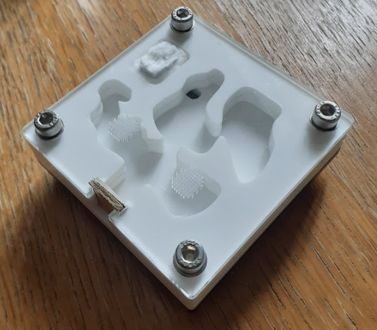

# Ant Fort

The Ant Fort is a formicarium designed to be constructed from laser-cut acrylic. The intention is to follow a modular design so that a colony can be easily extended as it grows.

## Modules

### Small nest

* Chambers for a small colony.
* Hydration provided by cotton wool accessed via channel.

_V1 is pictured._

## Module Specifications

* Modules are composed from 5 layers:
    * A base layer, 5mm thick, (black used here).
    * A floor layer, 5mm thick, (white used here).
    * Two wall layers, each 5mm thick (white used here).
    * Clear acrylic top, 3mm thick.
* **Size:** Module size should be an integer multiple of 80mm. For example, the smallest module is 80x80mm.
* **Fasteners:** Layers are held together by M5 nuts and bolts. The holes are 5mm diameter. The hole centres are located 7.5mm from the edge, with a horizontal/vertical separation between holes of 65mm.
* **Ventilation:** Grids of 0.5mm diameter holes.

### Connector specifications

* The connector block is made from a 'sandwich' of 4 layers:
    * A: rectangle, 3mm thick. Barrier is 14mm wide x 18mm tall.
    * B: rectangle, 3mm thick. Barrier is 10mm wide x 13mm tall.
    * C: rectangle, 3mm thick. Barrier is 10mm wide x 13mm tall.
    * D: rectangle, 3mm thick. Barrier is 14mm wide x 18mm tall. Added grip/insertion.
* A hole is cut through the pieces to allow passage.

* A 'blank' piece can be made by taking layers C&D and removing the hole.

## File specifications

* Saved in SVG format (inkscape).
* The output files are the format required for manufacture @ RazorLabs (a UK supplier).